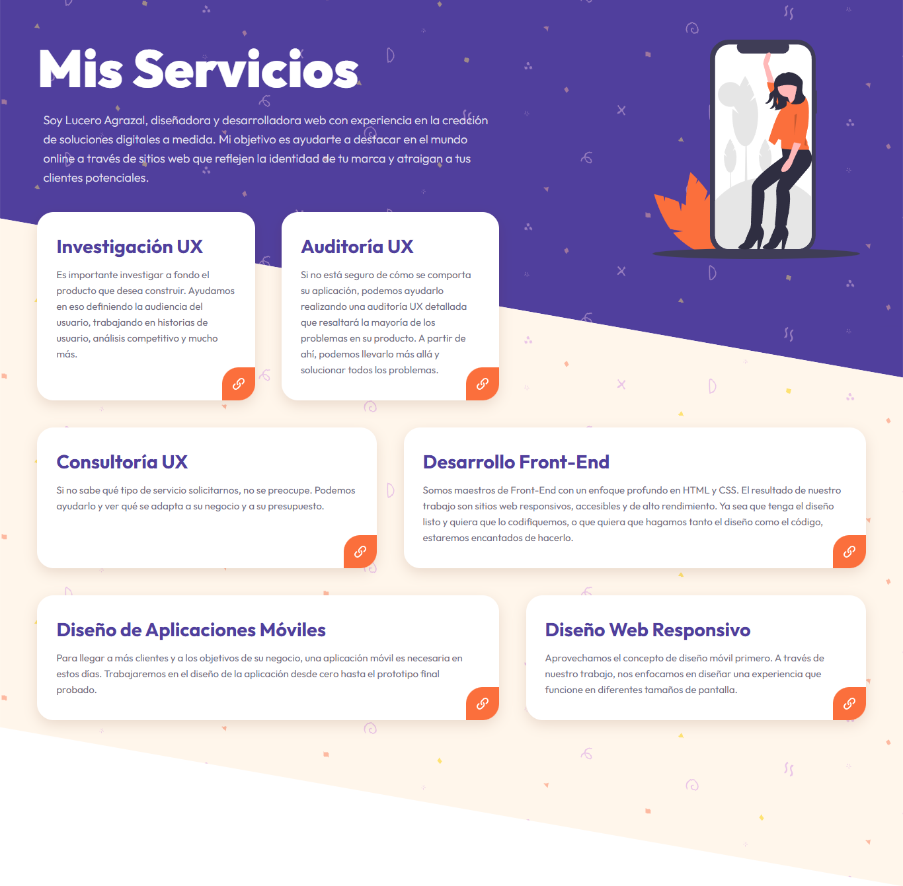

# 🛠️ Mis Servicios - Portafolio Interactivo con Variables CSS 🚀

¡Bienvenido a mi proyecto **Mis Servicios**! 🌟 Este es un portafolio interactivo que muestra los servicios que ofrezco, utilizando **variables CSS** y **JavaScript** para agregar dinamismo y mejorar la experiencia del usuario. El diseño es moderno, responsivo y está enfocado en destacar mis habilidades como desarrollador front-end.

## 🎨 Capturas de Pantalla



## 🛠️ Tecnologías Utilizadas

- **HTML5** - Estructura semántica del contenido.
- **CSS3** - Estilos personalizados y uso de **variables CSS** para dinamismo.
- **JavaScript** - Interactividad y funcionalidades dinámicas.
- **Google Fonts** - Fuentes modernas y legibles.
- **Normalize.css** - Para un estilo base consistente en todos los navegadores.

## 🚀 Características del Proyecto

- **Diseño Responsivo**: Adaptable a cualquier dispositivo, desde móviles hasta escritorios.
- **Variables CSS**: Uso de variables para personalizar estilos y agregar interactividad.
- **Interfaz Limpia y Moderna**: Diseño minimalista y enfocado en el contenido.
- **Interactividad**: Efectos dinámicos y transiciones suaves para mejorar la experiencia del usuario.
- **Tipografía Elegante**: Uso de la fuente **Outfit** para un aspecto moderno y profesional.

## 🧑‍💻 Cómo Ejecutar el Proyecto

1. **Clona el repositorio**:
   ```bash
   git clone (https://github.com/Lucer16/Proyecto-MisServicios)
